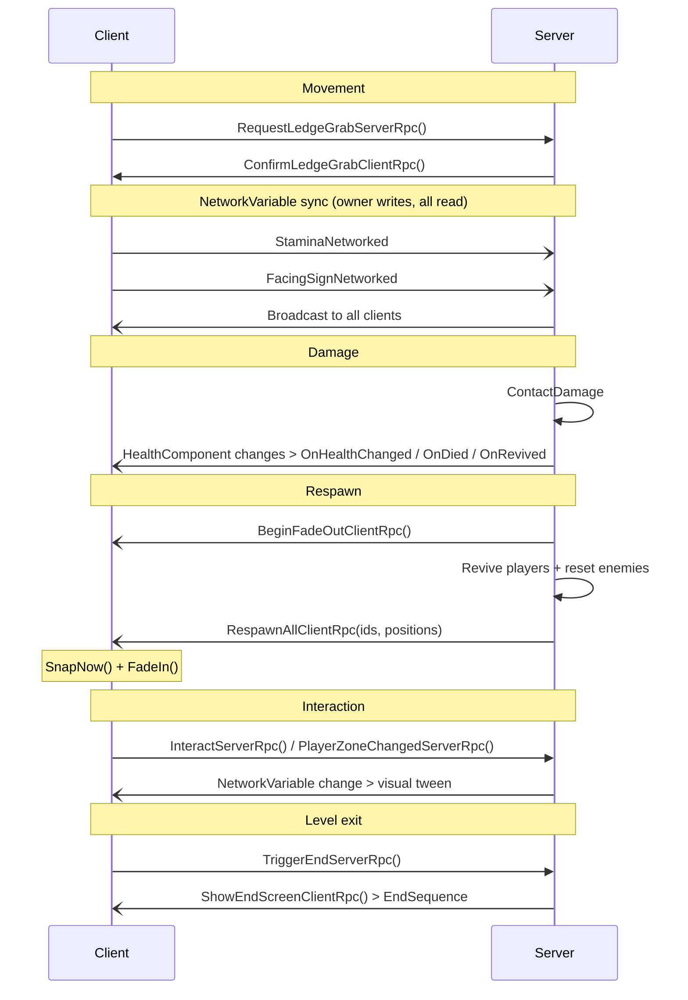

# Maze Runner: Survive

## Overview

A 2-player online co-op 2D platformer built with **Unity** and **Unity Netcode for GameObjects (NGO)**,
using **Unity Relay** for NAT-punching / matchmaking-free multiplayer. The architecture is
**server-authoritative**: a dedicated/host process runs all game logic; clients send inputs and
receive state updates.

This project started off as a split screen co-op game. That's when I built the level and most of the base mechanics and interactions. For this course I took what I had an transitioned it into an online co-op platformer. It was always the plan to do this so I tried to set up the split-screen version to be as easy as possible to make this transition. However actually doing it was much more difficult than I had initially anticipated, and required a lot of reworking and testing to get somewhat working. Some things are still broken and the game feel is definitely worse after the transition but I tried my best.

---

## Technology Stack

| Layer | Technology |
| --- | --- |
| Engine | Unity (2D, Rigidbody2D physics) |
| Networking | Unity Netcode for GameObjects (NGO) |
| Transport | Unity Transport (UTP) with Unity Relay |
| Services | Unity Services (Auth, Relay) |
| Input | Unity Input System (two control schemes: WASD + Arrows) |
| UI | Unity UI / TextMeshPro |

---

## Systems

### Networking & Session Bootstrap (`NetworkSetup`, `LobbyUI`)

- On launch, a lobby screen presents **Start Server** / **Join Game** choices.
- **Server path**: allocates a Unity Relay slot, obtains a 6-character join code, displays it, then calls `NetworkManager.StartServer()`.
- **Client path**: joins the Relay allocation by code, then calls `NetworkManager.StartClient()`.
- Session-full detection intercepts both the NGO `DisconnectReason` string and a native Relay log fragment (`"maximum connected players"`) via `Application.logMessageReceived`.
- Player prefabs are spawned server-side in `SpawnPlayerForClient()` using `NetworkObject.SpawnAsPlayerObject`.

### Player Controller (`PlayerController`, `PlayerInputHandler`)

- **Owner-authoritative movement**: `FixedUpdate` and input reading are gated behind `if (!IsOwner) return`.
- Implements a **4-state machine**: `Grounded`, `Airborne`, `LedgeHang`, `LedgeClimb`.
- **Ledge grab** uses a client > server > client RPC round-trip (`RequestLedgeGrabServerRpc` / `ConfirmLedgeGrabClientRpc`) so the server validates the geometry before the client transitions to the hang state. This introduces some lag and makes the ledge hang less responsive. Couldn't figure out how to make it better.
- Facing direction and stamina are published as `NetworkVariable<float>` (owner writes, all read) so other clients can mirror the sprite flip without polling.
- **Coyote time**, **jump buffering**, and **variable jump gravity** are implemented purely on the owning client.

### Stamina (`StaminaResource`, `StaminaBar`)

- `StaminaResource` is a plain serialisable class (no `MonoBehaviour`) ticked by `PlayerController`.
- The bar reads `PlayerController.StaminaNetworked` (a `NetworkVariable`) so it stays accurate even on the host watching the remote player.
- Non-owner stamina bars are hidden on spawn.

### Health & Damage (`HealthComponent`, `ContactDamage`)

- `_currentHealth` is a `NetworkVariable<float>` (server writes, all read).
- `OnValueChanged` drives `OnHealthChanged`, `OnDied`, and `OnRevived` on every client. No separate ClientRpc needed for health updates.
- `TakeDamage()` may be called directly on the server; clients use `TakeDamageServerRpc`.
- `Revive()` writes the NetworkVariable (which propagates) and fires `ReviveClientRpc` as a belt-and-suspenders ordering guard.
- `ContactDamage` gates all collision callbacks with `if (!IsServer) return` and maintains per-target cooldown timers.
- Invincibility window is server-only state.

### Checkpoint & Respawn (`CheckpointManager`, `Checkpoint`)

- `_activeCheckpointIndex` is a `NetworkVariable<int>` so late joiners instantly resolve the correct spawn point.
- `Checkpoint.OnTriggerEnter2D` calls `CheckpointManager.PlayerReachedCheckpoint()` locally; this forwards to `PlayerReachedCheckpointServerRpc` for authoritative ordering checks.
- Respawn sequence:
  1. Server starts `RespawnSequenceServerCoroutine`.
  2. `BeginFadeOutClientRpc` so each client fades its own screen.
  3. Server waits, resolves spawn positions, revives all `HealthComponent`s.
  4. `RespawnAllClientRpc(ids[], positions[])`. Each client repositions only its **owned** player; enemy positions are reset server-side.
- Camera snap (`NetworkCameraController.SnapNow`) is called client-side after repositioning to prevent slide-in on fade-back.

### Camera (`NetworkCameraController`)

- Entirely **client-side**.
- Each client calls `SetTarget()` with its own player's transform after spawn.
- Features: exponential decay follow, look-ahead offset blended by `FacingSignNetworked`, `BoxCollider2D` world bounds clamp.

### Enemy AI (`EnemyController`)

- 3-state machine: `Idle` > `Chase` > `Investigate` > `Idle`.
- Runs **server-only** (`if (!IsServer) return` in `FixedUpdate`).
- Line-of-sight via `Physics2D.Raycast` with a configurable blocking layer mask.
- Target selection queries `PlayerRegistry` every `targetUpdateInterval` seconds.
- `ResetToSpawn()` is called by `CheckpointManager` on respawn; does nothing if the enemy is dead (dead enemies self-destruct via `Destroy`).

### Player Registry (`PlayerRegistry`)

- Singleton dictionary of `PlayerController > HealthComponent`.
- Players register in `OnEnable` / deregister in `OnDisable`. Automatically correct as NetworkObjects spawn/despawn.
- Queried by `EnemyController` (closest target) and `CoopExitTrigger` (living player count).

### Exit Trigger (`CoopExitTrigger`)

- Three modes: `Any`, `All`, `SpecificCount`.
- Tracks per-player collider counts (handles composite colliders correctly).
- Fires `OnWaiting` / `OnWaitingCancelled` events for "wait for partner" UI.
- Wired to `GameEndManager.OnLevelExitTriggered` via Inspector `UnityEvent`.

### Level End (`GameEndManager`)

- `OnLevelExitTriggered` (callable from any client or server) > `TriggerEndServerRpc` > `ShowEndScreenClientRpc`.
- Each client runs its own `EndSequence` coroutine: fade out > hold > show panel > fade in.
- When this screen is visible it was meant to be possible to restart the level but I couldn't get this to work in time.

### Interactive Objects (`ActivationButton`, `ActivatableObject`)

- `ActivatableObject._isActive` is a `NetworkVariable<bool>` (server writes).
- Visual transition (instant / scale tween / fade tween) runs **client-side** from `OnValueChanged`.
- Physics collider toggling is done **server-side** for authoritative contact detection.
- `ActivationButton` supports three activation modes (`PressToActivate`, `AutoOnEnter`, `PressurePlate`) and three toggle behaviours (`Toggle`, `OneShot`, `Momentary`).
- Local trigger tracking uses a per-handler collider count (same pattern as `CoopExitTrigger`).
- `InteractServerRpc` / `PlayerZoneChangedServerRpc` carry all state changes to the server.

### Moving Platforms (`PlatformMover`)

- Runs server-side (`if (!IsServer) return`).
- Carries passengers by detecting `Rigidbody2D` objects landing on top (`contact.normal.y >= 0.5`).
- Passenger movement delivered via `CarryPassengerClientRpc(networkObjectId, delta)`. Only the **owning client** applies the delta to avoid fighting `NetworkTransform`.
- Supports `PingPong`, `Loop`, and `Once` modes, per-segment speed overrides, easing, initial delay, and waypoint pause.

### Screen Fader (`ScreenFader`)

- Fully client-side; creates its own Canvas + Image at runtime, no prefab required.
- Returns a `Coroutine` from `FadeOut` / `FadeIn` so callers can `yield return` it.

### Debug Console (`DebugConsole`)

- Captures `Application.logMessageReceived`, renders coloured lines with a scrollable IMGUI overlay.
- Toggle with the backtick key; always-visible toggle button in the top-left corner.
- Instrumental in actually being able to debug what was going on during development
- Disabled in final build

---

## Network Architecture

---

## Editor Tools (`NetworkSetup` — `#if UNITY_EDITOR`)

Available under the **Tools** menu:

| Menu Item | Description |
| --- | --- |
| Build Windows (x64) | Builds a standalone Windows executable |
| Build and Launch (Server + Client) | Builds then opens one server window and one client window |
| Build and Launch (Server) | Builds then opens a server window only |
| Build and Launch (Client) | Builds then opens a client window only |
| Launch (Server + Client) F11 | Launches last build as server + client |
| Close All | Kills all running instances of the built executable |

Based on the class project. Quite useful early on to get something working with direct connections. Once I was using Relay these lost some usefulness and I didn't bother creating new ones.

## Bibliography / Resources used

- <https://www.youtube.com/watch?v=3yuBOB3VrCk>
- Class recordings
- <https://docs.unity.com/en-us/mps-sdk>
- Okapi Kit (for early iteration)
